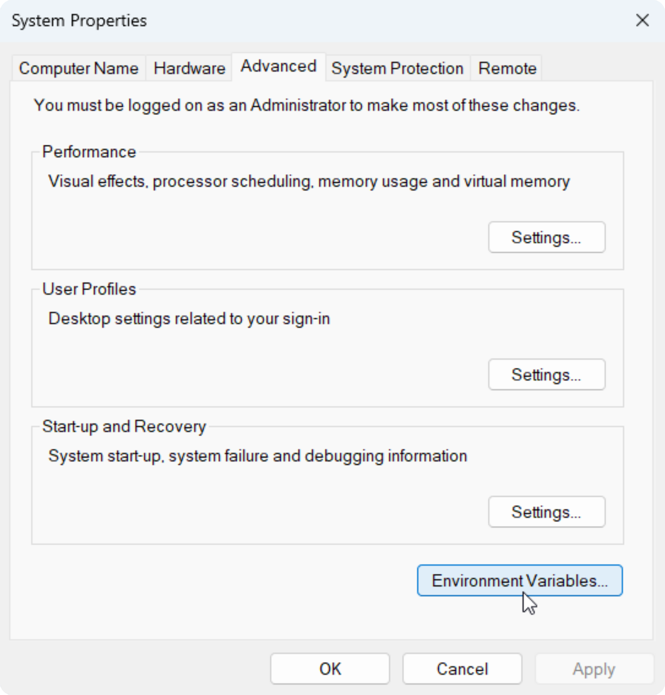
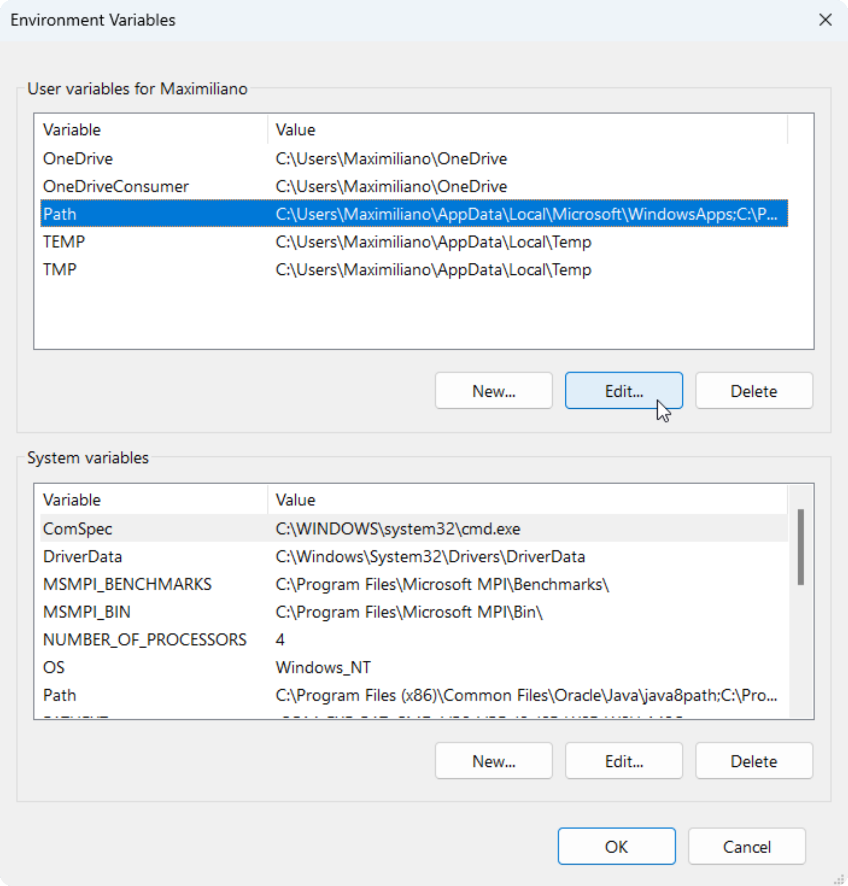
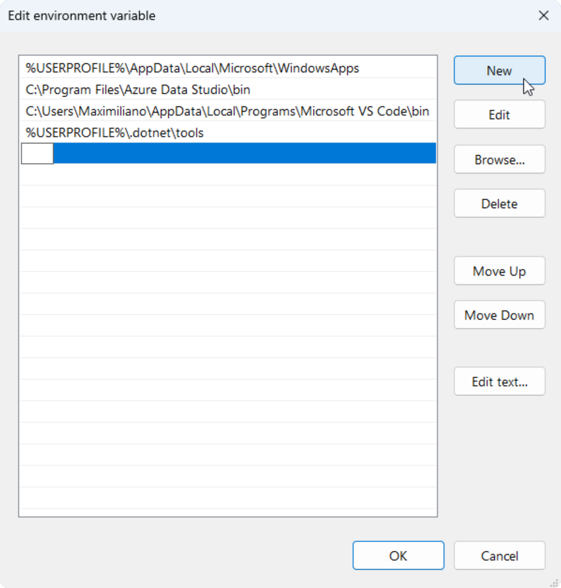

# C++ en VS Code

## Compilador

&nbsp;
Cuando programás en C++, escribís código en un archivo de texto con extensión `.cpp`. Sin embargo, la computadora no entiende directamente ese código, y necesita traducirlo. El compilador toma el código fuente codificado en C++ y lo convierte en un archivo ejecutable, que en Windows tiene extensión `.exe`.

>[!IMPORTANT]
&nbsp;
A diferencia de MacOs y Linux, Windows no tiene un compilador de C++ instalado de manera predeterminada.

### Instalación de w64devkit

>[!IMPORTANT]
&nbsp;
A diferencia de CodeBlocks y otros IDEs, Visual Studio Code es un editor de código por lo que que no cuenta con un compilador de C++.

&nbsp;
Si no tenés instalado ningún compilador de C++, podés descargar [w64devkit](https://github.com/skeeto/w64devkit) que incluye el compilador `gcc/g++`.

1. Dirigite a los [Releases](https://github.com/skeeto/w64devkit/releases) del repositorio y descargá el instalador `.exe` acorde a la arquitectura que tenga tu sistema operativo.

2. Descomprimilo y copiá la ruta de la carpeta bin que contiene el paquete, donde se encuentran todos los compiladores que provee. Si hiciste la instalación en el disco rígido, la ruta debería ser:

    ```
    C:\w64devkit\bin
    ```

### Variables de entorno

&nbsp;
Las variables de entorno son valores almacenados en el sistema operativo para poder ser usados por programas. El `Path` es una variable de entorno que almacena las rutas donde el sistema busca archivos ejecutables.

&nbsp;
Para que VS Code pueda usar el compilador `gcc/g++` que incluye [w64devkit](https://github.com/skeeto/w64devkit), es necesario agregarlo al `Path`. Pero podés agregar cualquier compilador que tengas instalado.

1. En inicio, buscar `env`:

    

2. Abrir las variables de entorno:

    

3. Editar el `Path`:

    

4. Agregar una nueva ruta y pegar la ruta del compilador:

    

## Visual Studio Code

1. Descargar e instalar [Visual Studio Code](https://code.visualstudio.com).

2. Instalar la extensión [C/C++](https://marketplace.visualstudio.com/items?itemName=ms-vscode.cpptools) en Visual Studio Code.

3. Crear un archivo llamado `tasks.json` en una carpeta llamada `.vscode` dentro del Workspace, a partir de la siguiente plantilla:

    ```json
    {
        "version": "2.0.0",
        "tasks": [
            {
                "label": "C/C++: g++.exe",
                "detail": "Compile on Windows",
                "type": "shell",
                "command": "g++.exe",
                "args": [
                    "-fdiagnostics-color=always",
                    "-std=c++17",
                    "-Wall",
                    "-Wextra",
                    "-pedantic",
                    "${fileDirname}\\main.cpp",
                    "-o",
                    "${fileDirname}\\${fileBasenameNoExtension}.exe"
                ],
                "options": {
                    "cwd": "${fileDirname}"
                },
                "problemMatcher": [
                    "$gcc"
                ],
                "group": {
                    "kind": "build"
                }
            }
        ]
    }
    ```

## Compilar y ejecutar

1. Dirigirse al menú `Terminal`, seleccionar `Run Task...` y luego elegir la task llamada `Compile on Windows`.

    >[!NOTE]
    &nbsp;
    Debería generarse un archivo `main.exe` en el mismo directorio que `main.cpp`.

4. Dirigirse al menú `Terminal`, y seleccionar la opción `New Terminal` para inicializar una terminal bash donde se encuentre el archivo `main.exe` compilado.

    >[!TIP]
    &nbsp;
    Podés usar los comandos `cd` y `..` para navegar con la terminal hasta ubicarte donde está el archivo `main.exe`.

5. Ejecutar el programa, usando el comando:

    ```bash
    .\main.exe
    ```